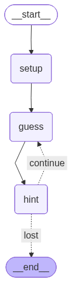

# Assignment 3: Automatic Higher or Lower Game

This assignment involves creating a self-correcting loop that plays a "Higher or Lower" guessing game autonomously.

## The Challenge
Build a graph that:
1. Picks a random number between 1 and 20.
2. Makes a guess.
3. Receives a hint ("higher" or "lower").
4. Adjusts its bounds and guesses again.
5. Continues until the number is found or 7 attempts are reached.

## Key Implementation Details

### 1. Game State
The state tracks the bounds and the target, allowing the graph to "remember" the range it is searching in.
```python
class AgentState(TypedDict):
    player_name: str
    target: int
    guess: int
    lower_bound: int
    upper_bound: int
    correct: bool
```

### 2. Binary Search Logic
To solve the game efficiently, the `make_guess` node implements a binary search strategy by always guessing the midpoint of the current bounds.
```python
guess = (state['lower_bound'] + state['upper_bound']) // 2
```

### 3. State-Driven Routing
The `hint` node updates the `lower_bound` or `upper_bound` based on the comparison, and the `should_continue` router decides whether to loop back to the `guess` node.

## Workflow Visualization

The graph cycles between guessing and hinting until a termination condition is met.



## Lessons Learned
- **Dynamic State**: How to use state keys to refine logic over multiple iterations.
- **Loop Termination**: Implementing multiple exit conditions (Win vs. Max Attempts).
- **Strategy Implementation**: Encoding a search algorithm (Binary Search) within graph nodes.

## Detailed Breakdown: Anatomy of a Loop

Recurring loops in LangGraph are not like standard Python `while` loops. They are **state-driven transitions** where the graph execution flow revisits a previous node based on the evaluation of the current state.

### 1. The Circular Path
In this assignment, the loop is formed by the connection between the `hint` node and the `guess` node. This is a **recurrent edge**.

```python
workflow.add_conditional_edges(
    "hint",             # Source: After evaluating the guess
    should_continue,     # Decider: Logic to check if we loop or exit
    {
        "continue": "guess", # THE LOOP: Go back to make_guess node
        "won": END,
        "lost": END
    }
)
```

### 2. State-Driven Iteration
For a loop to be useful, the **State** must evolve in each iteration. If the state remains static, the loop becomes infinite and unproductive.
- **Iteration 1**: Range 1-20, Guess 10. Hint: "Higher". State updates `lower_bound` to 11.
- **Iteration 2**: Range 11-20, Guess 15. Hint: "Lower". State updates `upper_bound` to 14.
- **Convergence**: Each loop narrows the search space until `lower_bound == upper_bound == target`.

### 3. Termination Guards
Every recurring loop must have "exit ramps" to prevent infinite execution:
1.  **Success Condition**: `state['correct'] == True` (Found the number).
2.  **Failure Condition**: `state['attempts'] >= 7` (Reached the maximum complexity allowed).

## Why This Pattern Matters
This pattern is the foundation for **AI Agents**. In complex systems, an agent might:
1.  Execute a tool.
2.  Observe the result.
3.  Decide to loop back and try a different tool or refine its query.
4.  Only exit when the task is complete.

---
## Related Concepts
- [Loops (Recurrent Graphs)](concept_loops.md)
- [Conditional Edges](concept_conditional_edges.md)
- [Nodes vs. Edges](concept_nodes_vs_edges.md)

---
[Back: Lesson 5: Looping Graphs](l5_recurrent_loops.md) | [Next: Wiki Index](../index.md)
