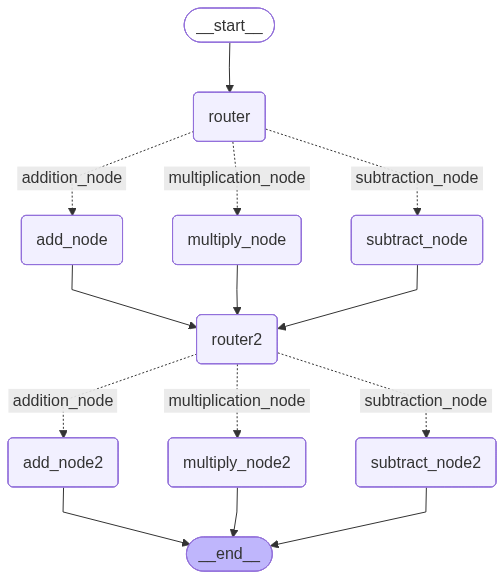

# Assignment 2: Multi-Stage Routing

This assignment explores a more complex workflow where multiple routing steps are connected sequentially.

## The Challenge
Create a graph that:
1. Starts with a router.
2. Branches to one of three operation nodes (`add`, `subtract`, `multiply`).
3. Passes the result to a **second** router.
4. Branches again to a second set of operation nodes.
5. Finally reaches the end.

## Key Implementation Details

### 1. Reusing Node Functions
In this assignment, we reused the same logic for different nodes in the graph.
```python
workflow.add_node("add_node", add)
workflow.add_node("add_node2", add) # Same function, different node name
```

### 2. Chaining Routers
The output of the first set of nodes is directed to `router2`, which then applies the same (or different) conditional logic to decide the next path.

```python
workflow.add_edge("add_node", "router2")
workflow.add_edge("multiply_node", "router2")
workflow.add_edge("subtract_node", "router2")
```

## Graph Visualization

The resulting graph demonstrates a symmetric, multi-stage structure:



## Lessons Learned
- **Node Naming**: Every node must have a unique name, even if they use the same underlying function.
- **Sequential Flow**: You can mix sequential edges (`add_edge`) and conditional edges (`add_conditional_edges`) to create complex pipelines.
- **Visualization**: Using `draw_mermaid_png()` makes it much easier to verify that the complex routing logic is correctly wired.

---
## Related Concepts
- [Conditional Edges](concept_conditional_edges.md)
- [Graph Visualization](concept_visualization.md)

---
[Back: Lesson 4: Conditional Edges](l4_conditional_node.md) | [Next: Lesson 5: Looping Graphs](l5_looping_graphs.md)
