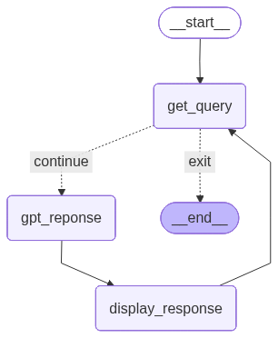

# Assignment 4: Interactive LangGraph Chatbot

This assignment transforms the sequential LLM integration from Lesson 6 into a persistent, interactive chatbot using recurrent loops and terminal-based input.

## The Challenge
Create a chatbot that:
1. Maintains a persistent conversation history.
2. Loops back to the user for input after each response.
3. Provides a clean, formatted interface using `Rich`.
4. Terminates gracefully when the user types "exit".

## Implementation Details

### 1. Loop Topology
The key to interactivity is the edge that connects the final `display_response` node back to the `get_query` node.

```python
workflow.add_edge("display_response", "get_query")
```

### 2. History Management
The state's `messages` list is updated in every iteration of the `gpt_reponse` node, allowing the LLM to remember previous turns.

```python
def gpt_reponse(state):
    messages = state.get('messages', [])
    messages.append({"role": "user", "content": state['query']})
    # ... call API ...
    messages.append({"role": "assistant", "content": answer})
    state['messages'] = messages
    return state
```

### 3. Conditional Termination
The `router` checks the user input for exit keywords to break the loop.

```python
def router(state):
    if state['query'].lower() in ["exit", "quit"]:
        return "exit"
    return "continue"
```

### 4. LLM Streaming
To improve User Experience (UX), the chatbot implements token streaming. Instead of waiting for the full response, tokens are printed to the console as they are generated by the LLM.

```python
stream = client.chat.completions.create(..., stream=True)
for chunk in stream:
    if chunk.choices[0].delta.content:
        print(chunk.choices[0].delta.content, end="", flush=True)
```

## Workflow Visualization
The loop cycle: `Input` -> `Router` -> `Streaming LLM` -> `Input`.

 
*(Note: Visual pattern continues to evolve)*

## Lessons Learned
- **Human-in-the-loop**: How to pause graph execution for user input using standard Python functions within a node.
- **State Persistence**: Maintaining context across multiple loop cycles.
- **UX in CLI**: Using colors and formatting to distinguish between User and Assistant.

---
## Related Concepts
- [Loops (Recurrent Graphs)](concept_loops.md)
- [Integrating LLMs](l6_integrating_llm.md)

---
[Back: Lesson 6: Integrating LLMs](l6_integrating_llm.md) | [Next: Wiki Index](../index.md)
