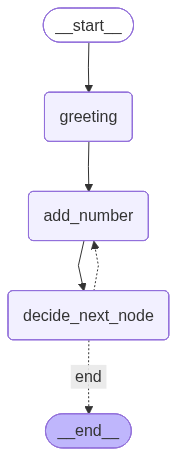

# Lesson 5: Looping Graphs

This lesson introduces the concept of **Recurrent Graphs** (loops), where the graph can revisit previous nodes based on a condition.

## Key Concepts

### 1. Creating a Loop
In this example, we create a loop that generates random numbers until a counter reaches 5. This is done by adding a conditional edge from a decision node back to the `add_number` node.

```python
workflow.add_conditional_edges(
    "decide_next_node",
    decide_next_node,
    {
        "add_number": "add_number", # Loop back
        "end": END                  # Exit
    }
)
```

### 2. Termination Logic
The `decide_next_node` function acts as the loop controller. It checks the `count` key in the state:
- If `count < 5`, it returns `"add_number"`, triggering the loop.
- If `count >= 5`, it returns `"end"`, terminating the graph.

## Workflow Visualization

The graph structure shows a clear cycle:
- **START** -> **greeting** -> **add_number** -> **decide_next_node**
- **decide_next_node** --(loop)--> **add_number**
- **decide_next_node** --(exit)--> **END**



## Common Pitfalls
- **Infinite Loops**: If the counter never increments or the condition is never met, the graph will run forever.
- **State Mutation**: Ensure that the node being looped into correctly updates the state that the router depends on.

---
## Related Concepts
- [Loops (Recurrent Graphs)](concept_loops.md)
- [Conditional Edges](concept_conditional_edges.md)
- [Graph Visualization](concept_visualization.md)

---
[Back: Assignment 2: Multi-Stage Routing](assignment_2.md) | [Next: Assignment 3: Automatic Higher or Lower Game](assignment_3.md)
