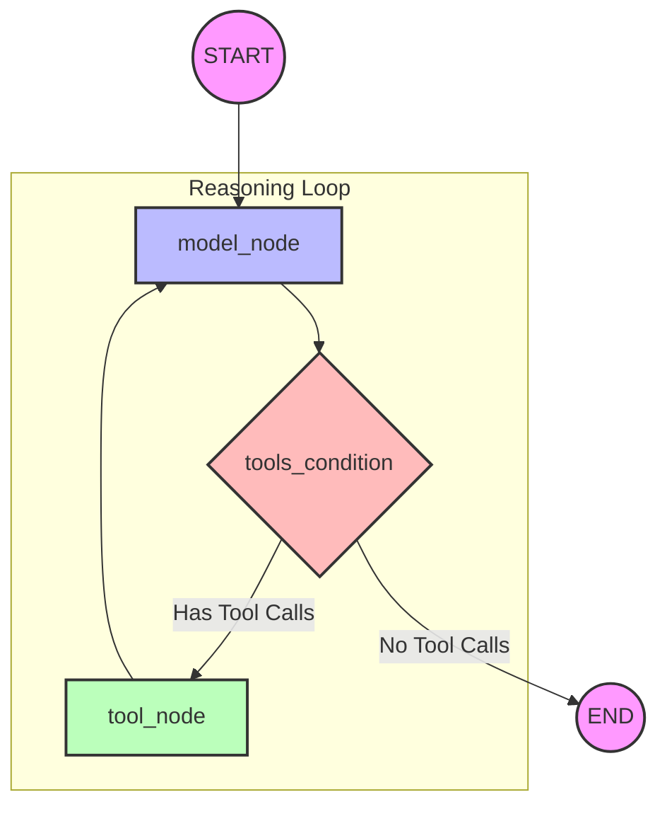

# Process Flow Diagram: ReAct Agent (Lesson 7)

This document provides a detailed breakdown of the internal workflow and state transitions within the ReAct Agent implemented in `l7_ReAct_agent.py`.

## 1. High-Level Flow Chart

## 2. Step-by-Step Execution Details

### Step 1: Initialization (START)
- **Input**: The user provides an initial message (e.g., `"Add 40 + 12"`).
- **State**: The `AgentState` is initialized with a list of messages containing the `HumanMessage`.

### Step 2: Reasoning (model_node)
- **Action**: The graph executes the `model_call` function.
- **LLM Input**: Receives the full conversation history (System Prompt + Messages).
- **LLM Output**: The model decides to either answer directly or call a tool. 
- **State Update**: The `AIMessage` (potentially containing `tool_calls`) is appended to the `messages` list via the `add_messages` reducer.

### Step 3: Routing (tools_condition)
- **Action**: The conditional edge (Router) inspects the last message in the state.
- **Decision**:
    - **IF** `message.tool_calls` exists: Route to `tool_node`.
    - **ELSE**: Route to `END`.

### Step 4: Execution (tool_node)
- **Action**: The `ToolNode` (from `langgraph.prebuilt`) takes over.
- **Processing**: It parses the `name` and `args` from the LLM's request and executes the corresponding Python function (e.g., `add(40, 12)`).
- **State Update**: A `ToolMessage` containing the result (e.g., `52`) and the `tool_call_id` is appended to the state.

### Step 5: Recurrence (Loop)
- **Action**: The graph flows from `tool_node` back to `model_node`.
- **Reasoning**: The LLM now sees its previous thought, the tool request, and the **result** of that tool. It can now reason about the next step (e.g., multiplying the result).

### Step 6: Completion (END)
- **Action**: Once the LLM determines it has all the information, it returns a plain text `AIMessage`.
- **Router**: Detects no tool calls and routes the graph to the terminal `END` node.

---
## 3. State Evolution Example
1. **Initial**: `[Human("Add 1+1")]`
2. **After Model**: `[Human("Add 1+1"), AI(tool_call="add(1,1)")]`
3. **After Tools**: `[Human("Add 1+1"), AI(tool_call="add(1,1)"), Tool(content="2")]`
4. **Final Model**: `[Human("Add 1+1"), AI(tool_call="add(1,1)"), Tool(content="2"), AI(content="The answer is 2")]`

---
[Back to Lesson 7](l7_ReAct_agent.md) | [Wiki Index](../index.md)
