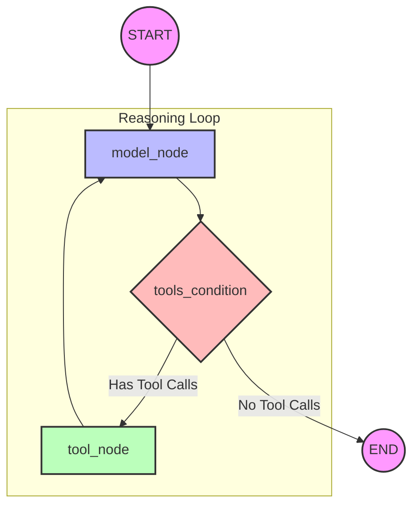

# Process Flow Diagram: ReAct Agent (Lesson 7)

This document provides a detailed breakdown of the internal workflow and state transitions within the ReAct Agent implemented in `l7_ReAct_agent.py`.

## 1. High-Level Flow Chart



## 2. Step-by-Step Execution Details

### Step 1: Initialization (START)
- **Input**: The user provides an initial message.
- **State**: The `AgentState` is initialized.
```python
class AgentState(TypedDict):
    messages: Annotated[Sequence[BaseMessage], add_messages]
```

### Step 2: Reasoning (model_node)
- **Action**: The graph executes the `model_call` function.
- **LLM Input**: Receives the full conversation history (System Prompt + Messages).
```python
def model_call(state : AgentState) -> AgentState:
    system_prompt = SystemMessage(content = "You are an AI assistant...")
    response = model.invoke([system_prompt] + state['messages'])
    return {"messages" : [response]}
```

### Step 3: Routing (tools_condition)
- **Action**: The conditional edge (Router) inspects the last message.
```python
# Prebuilt routing logic used in the graph
workflow.add_conditional_edges(
    "model_node",
    should_continue, # Custom router or tools_condition
    {"continue": "tool_node", "end": END}
)
```

### Step 4: Execution (tool_node)
- **Action**: The `ToolNode` executes requested Python functions.
```python
# Tools bound to the node
tools = [add, subtract, divide, multiply]
workflow.add_node("tool_node", ToolNode(tools = tools))
```

### Step 5: Recurrence (Loop)
- **Action**: The graph flows back to `model_node`.
```python
# The loop edge
workflow.add_edge("tool_node", "model_node")
```

### Step 6: Completion (END)
- **Action**: The graph terminates when no tool calls are present.
```python
def should_continue(state : AgentState) -> str:
    response = state['messages'][-1]
    if not response.tool_calls:
        return "end"
    return "continue"
```

---
## 3. State Evolution Example
1. **Initial**: `[Human("Add 1+1")]`
2. **After Model**: `[Human("Add 1+1"), AI(tool_call="add(1,1)")]`
3. **After Tools**: `[Human("Add 1+1"), AI(tool_call="add(1,1)"), Tool(content="2")]`
4. **Final Model**: `[Human("Add 1+1"), AI(tool_call="add(1,1)"), Tool(content="2"), AI(content="The answer is 2")]`

---
[Back to Lesson 7](l7_ReAct_agent.md) | [Wiki Index](../index.md)
