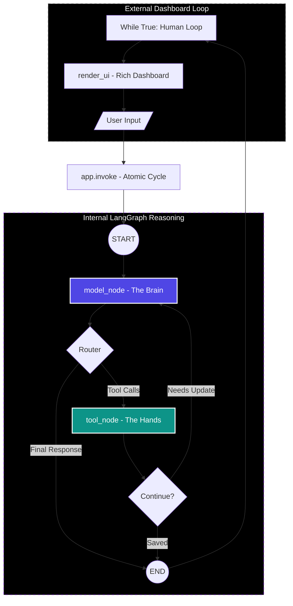

# Process Flow Diagram: Project Drafter (Lesson 9)

This document details the interaction between the **External Human Loop** and the **Internal LangGraph Reasoning Cycle**.

## 1. High-Level Architecture

## 2. Key Differences from Standard ReAct
- **Persistence**: The state is passed back and forth between the loop and the graph.
- **UI Decoupling**: The terminal is cleared and updated only once per turn by the loop, preventing the "thinking" node from causing flicker.
- **Atomic Execution**: The graph doesn't wait for humans; it runs until it either hits a final answer or finishes its tool sequence.

---
[Back to Lesson 9](l9_project_drafter.md) | [Wiki Index](../index.md)
